<p align="center">
  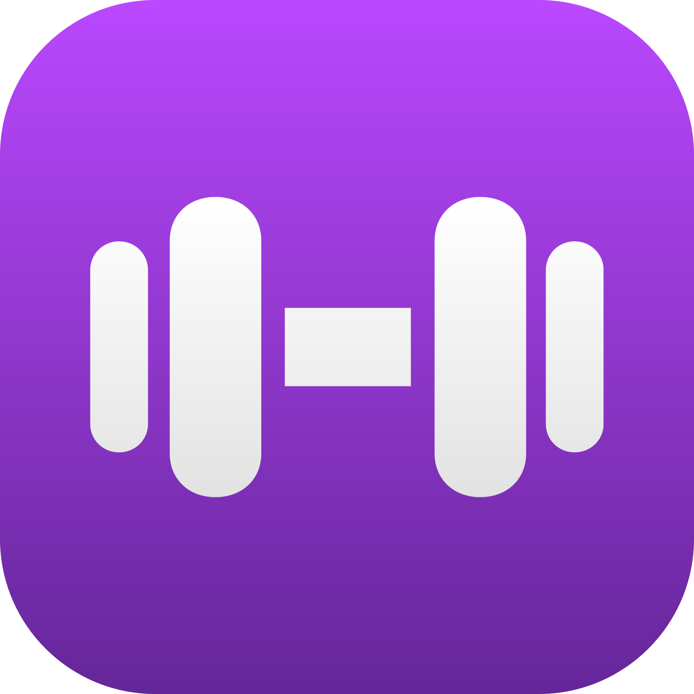
</p>

<h1 align="center">LiftRun</h1>

<p align="center"><b>Arrête de deviner. Progresse.</b><br />
L'app iOS qui te dit quoi soulever à chaque séance — musculation, course et récupération réunies.</p>

<p align="center">
  <a href="https://apps.apple.com/fr/app/liftrun/id6793467159">📲 Disponible gratuitement sur l'App Store</a>
</p>

<p align="center">
  
  
  
  
  
  
  
</p>

<p align="center">
  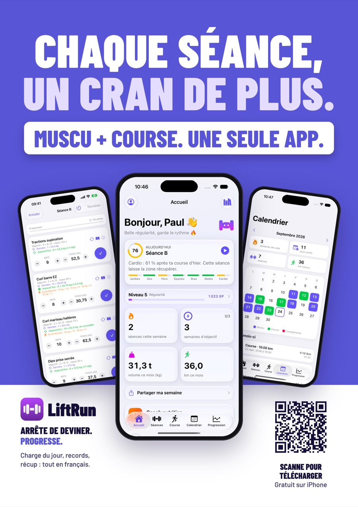
</p>

---

## ✨ Fonctionnalités

### 🧠 Un coach à chaque série
- **Objectif du jour** sur chaque exercice (double progression) : toutes les séries au plafond de la fourchette → un cran de charge et retour au bas de la fourchette ; sinon une répétition de plus ; sous la fourchette → on consolide
- Cran adapté au matériel : **+2,5 kg** barre et machine, **+2 kg** haltères, **+1 kg** sous 10 kg, répétitions au poids du corps, secondes au gainage
- **Échauffement calculé** à partir de la charge du jour (barre à vide puis 50 / 70 / 85 %, paliers arrondis vers le bas)
- **Records détectés en direct** (charge et 1RM estimé par la formule d'Epley), avec célébration en fin de séance
- **Machine prise ?** Remplacement de l'exercice par un équivalent en un geste
- **Séance express** : la séance condensée pour tenir dans le temps disponible (repos puis isolation raccourcis d'abord)
- **Reprise après une pause** et **semaine allégée**, avec charges réduites automatiquement
- La séance en cours est **sauvegardée** : si l'app se ferme, elle reprend là où tu l'avais laissée

### 💪 Musculation
- Programme A/B/C préchargé et éditeur complet de séances, timer de repos automatique
- **Bibliothèque de 1 324 exercices expliqués en français** : recherche (accents facultatifs), filtres par zone et matériel, fiches d'exécution pas à pas
- Photos de mouvement libres de droits ([Free Exercise DB](https://github.com/yuhonas/free-exercise-db)) sur 155 exercices
- **Calories estimées selon les charges soulevées**, pas seulement selon la durée

### ❤️ Forme du jour et récupération
- **Forme du jour** sur 7 zones (jambes, dos, pecs, épaules, bras, abdos, cardio) qui croise la muscu **et** la course, avec la séance conseillée
- **Apple Santé** : écriture des séances, courses et repas ; lecture sur autorisation des entraînements, du sommeil et de la variabilité cardiaque
- Point du matin (une notification par jour au maximum)

### 🏃 Course
- GPS avec carte en direct, écran verrouillé, pause et reprise, export GPX
- **Test de VMA** (demi-Cooper, 6 min), allures d'entraînement et **séances fractionnées guidées**
- **Plans 10 km, semi-marathon et marathon**
- **Course hybride** (8 × 1 km + 8 ateliers) : simulation chronométrée segment par segment, paliers à débloquer, plan de 8 semaines (Premium)
- Circuits préenregistrés à Nantes et Challans (Premium), dépose n'importe quel `.gpx` pour en ajouter

### 🎮 Motivation
- **Points d'expérience et niveaux**, paliers hybrides, régularité mesurée à la semaine
- Ressenti de fin de séance et **image à partager** (séance ou bilan « Ma semaine »)
- Textes accordés au genre choisi dans le profil, sons et retours haptiques

### 📱 Intégration iOS
- **Live Activities** (Dynamic Island et écran verrouillé) pour le repos et la course
- **Widgets** d'écran d'accueil : régularité, volume hebdomadaire, raccourci course, forme du jour
- **Raccourcis Siri** pour lancer une séance à la voix
- App en **français, anglais et espagnol** (String Catalogs)

### 🍽️ Nutrition (Premium)
- Objectif calories et macros (Mifflin-St Jeor, facteur d'activité calibré sur les séances réellement enregistrées) : sèche, maintien ou prise de masse
- Journal alimentaire : 2 298 aliments de la table CIQUAL 2020, **scan de code-barres** (Open Food Facts) et **saisie en langage naturel** (Apple Intelligence, sur l'appareil)
- Compléments du jour

### 🗂️ Tes données
- Sauvegarde complète dans un fichier, import de l'historique d'une autre app de suivi (CSV)
- Premium en **achat unique** (StoreKit 2) : nutrition, plan hybride, circuits, séances illimitées (3 en gratuit), calcul des disques, export CSV, thèmes

## 📸 Captures

| Accueil | Objectif du jour | Record en direct |
|:---:|:---:|:---:|
| 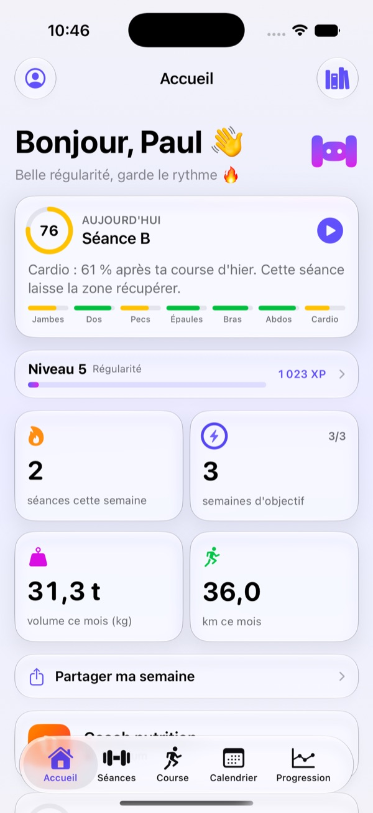 | 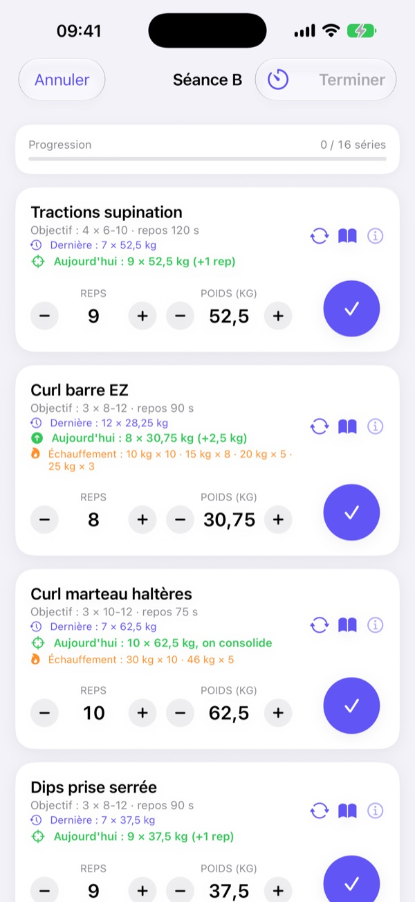 | 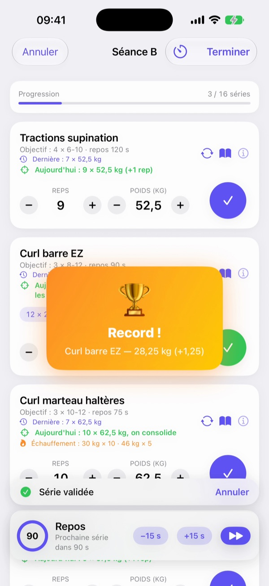 |

| Machine prise | Séance express | Récupération |
|:---:|:---:|:---:|
| 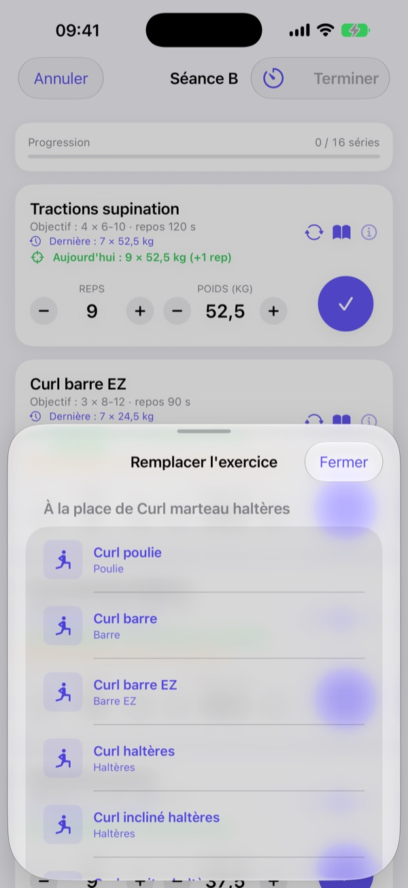 | 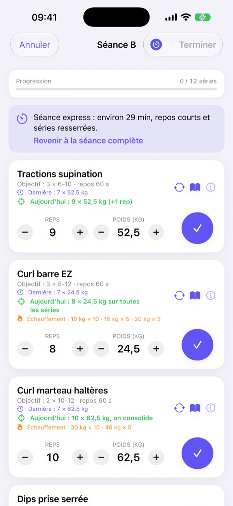 | 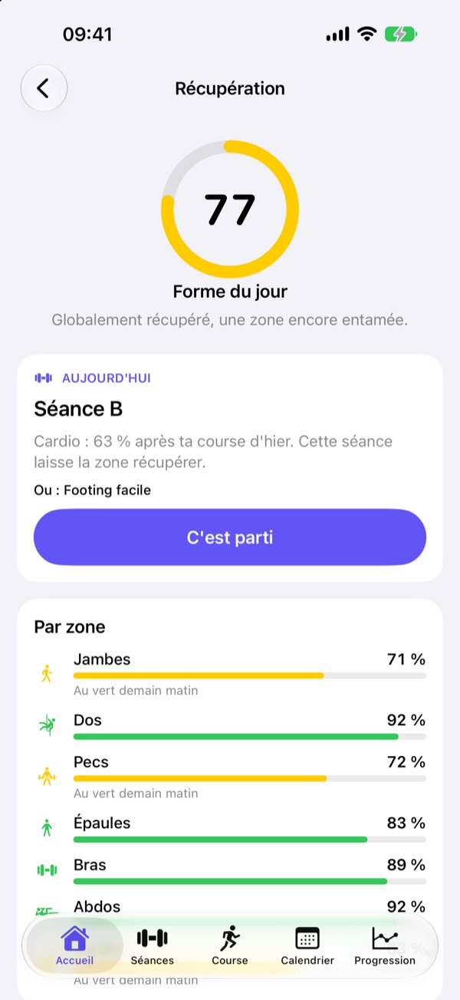 |

| Progression | Calendrier | Fiche d'exercice |
|:---:|:---:|:---:|
| 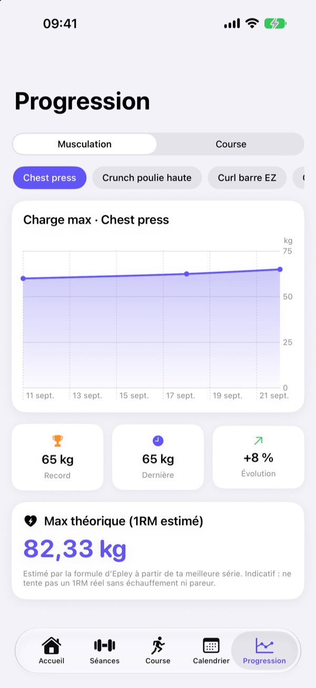 | 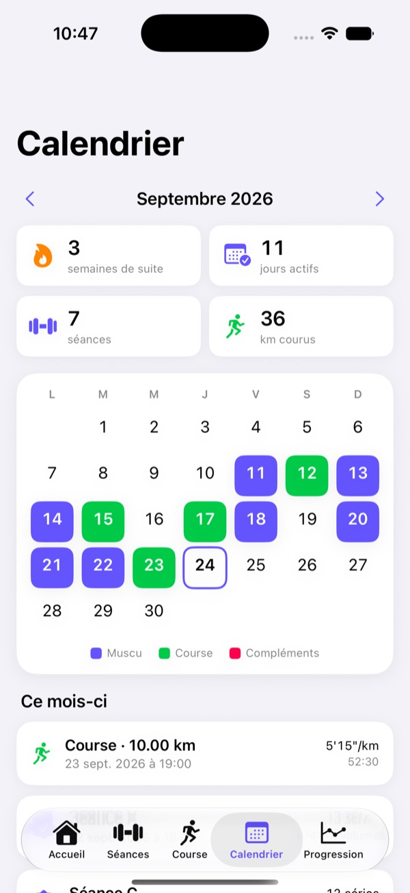 | 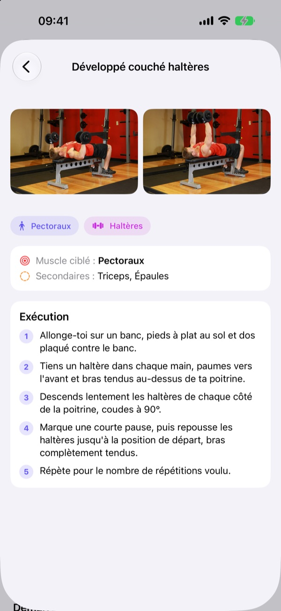 |

| Course hybride en direct | Plan hybride | Ma semaine |
|:---:|:---:|:---:|
| 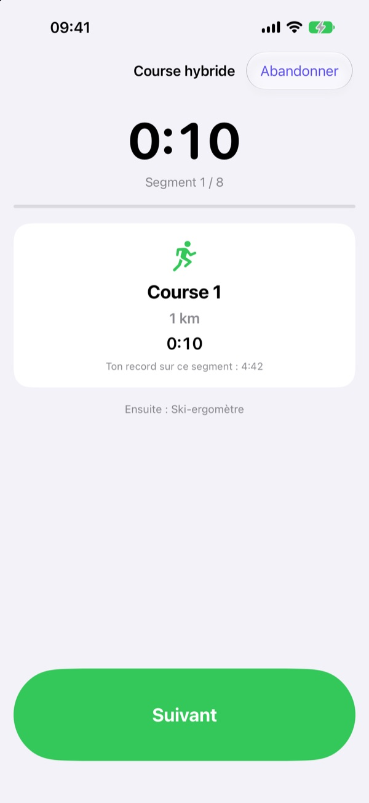 | 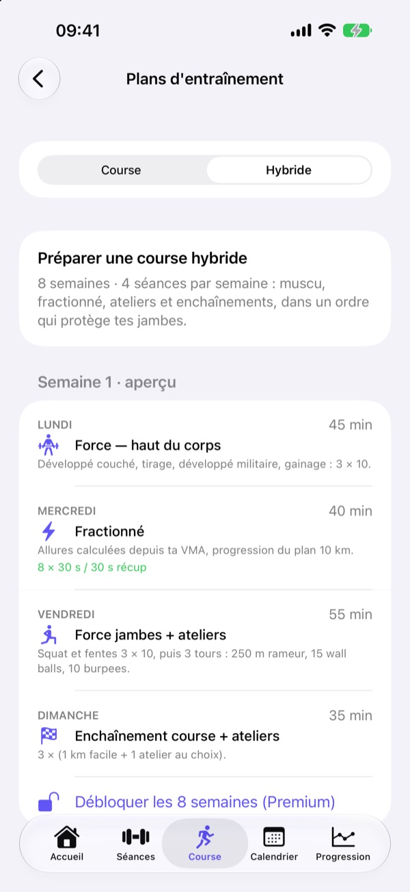 | 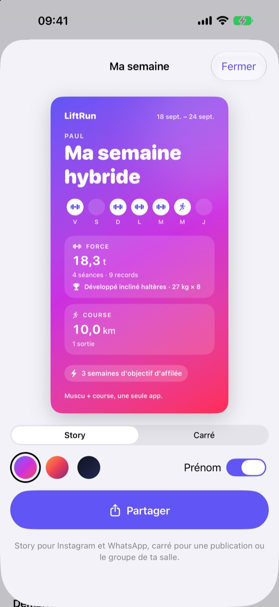 |

## 📣 Campagne de lancement

Six affiches A3 pour les salles de sport, avec un QR code vers l'App Store, accompagnées d'un film de 30 secondes et de micro-pubs verticales. Direction artistique : violet et blanc, Barlow Condensed.

<p align="center">
  
</p>

## 🧱 Architecture

```
GymTracker/                  # cible app (fr.devshield.gymtracker)
├── GymTrackerApp · RootTabView · Models           # point d'entrée, onglets, modèles SwiftData
├── Accueil      HomeView · TodayView · HybridReadiness · CoachBriefing · MascotView
├── Séance       TemplatesView · ActiveWorkoutView · WorkoutDraft · ProgressiveOverload
│                WorkoutCoaching · CoachingViews · CelebrationView · SessionShare
├── Exercices    ExerciseCatalog · ExerciseLibraryView · ExerciseNames · ExerciseTaxonomy · ExerciseTranslationsFR
├── Course       RunningView · RunTracker · GPXCircuits · RunningScience · VMATestView · IntervalSessionView
│                TrainingPlans(View) · HybridRace(View) · HybridPlan
├── Progression  ProgressChartsView · RunProgressView · HistoryView · Progression · ProgressionDetailView
│                Milestones · WeeklyRecap(View) · PremiumTools
├── Nutrition    Nutrition · NutritionView · BarcodeScanner · NaturalFoodEntry · SupplementsView
├── Système      HealthKitManager · LiveActivityManager · NotificationManager · AppIntents · Feedback
│                ReviewPrompt · InclusiveText · PremiumStore
├── Données      Backup · HistoryImport · DataToolsView · ProfileView · DemoData (Debug uniquement)
└── Ressources   exercises_catalog.json · exercises_fr.json · exercise_media.json · foods_*.json
                 Circuits/*.gpx · Localizable / InfoPlist / AppShortcuts .xcstrings

GymTrackerWidgets/           # extension : Live Activities et widgets d'écran d'accueil
└── GymTrackerWidgetsBundle · HomeWidgets · RestTimerLiveActivity · RunLiveActivity

GymTrackerTests/             # 79 tests XCTest : progression, échauffement, forme du jour,
                             # sauvegarde, import, course hybride, calories, séance reprise…
```

**Modèle de données (SwiftData)** : `WorkoutTemplate` 1—N `ExerciseTemplate` (programme éditable) · `WorkoutSession` 1—N `SetRecord` (historique muscu) · `RunSession` (courses, tracé GPS encodé) · `HybridRaceResult` (courses hybrides). La base est stockée dans l'App Group `group.fr.devshield.gymtracker`, lisible par les widgets.

**Intégration continue** : chaque push sur `main` déclenche Xcode Cloud (compilation, archive, envoi sur TestFlight).

## 🛠️ Installation

Prérequis : Xcode 26 ou plus récent, iPhone sous iOS 17.6 ou plus récent.

```bash
git clone git@github.com:paulolvrlct/GymTracker.git
cd GymTracker
open LiftRun.xcodeproj
```

1. Dans Xcode, choisis ton équipe (**Signing & Capabilities → Team**) sur **les deux cibles**. L'App Group `group.fr.devshield.gymtracker` et les bundle IDs sont déjà configurés : adapte-les si tu utilises ta propre équipe.
2. Sur l'iPhone, active le **mode développeur** (Réglages → Confidentialité et sécurité).
3. Lance avec **⌘R**. Au premier lancement, fais confiance au certificat (Réglages → Général → VPN et gestion d'appareils) et accepte la localisation et les notifications.

Lancer les tests :

```bash
xcodebuild test -project LiftRun.xcodeproj -scheme GymTracker \
  -destination 'platform=iOS Simulator,name=iPhone 17'
```

> ⏳ **Compte Apple gratuit** : la signature expire après 7 jours. Rebranche l'iPhone et relance ⌘R (les données sont conservées).

## 🔒 Données et confidentialité

**Aucun compte, aucun serveur LiftRun, aucune télémétrie.** Les séances, courses, repas et le profil restent sur l'appareil (SwiftData). La saisie d'aliments en langage naturel passe par Apple Intelligence, **sur l'appareil**.

Les seules connexions sortantes : le fond de carte Apple Plans en course, le chargement des photos d'exercices (Free Exercise DB) et, quand tu scannes un produit, la recherche de son code-barres sur Open Food Facts (seul le code-barres est envoyé). Voir la [politique de confidentialité](docs/politique-confidentialite.md).

## ⚖️ Licences

- **Code** : © DevShield — tous droits réservés.
- **Catalogue d'exercices** : structure textuelle (noms, muscles, instructions) issue de [hasaneyldrm/exercises-dataset](https://github.com/hasaneyldrm/exercises-dataset), traduite en français. Les médias propriétaires (images, GIF) ont été **retirés** de ce dépôt.
- **Photos d'exercices** : [Free Exercise DB](https://github.com/yuhonas/free-exercise-db), domaine public ([Unlicense](https://unlicense.org)), chargées à la demande.
- **Valeurs nutritionnelles** : [table CIQUAL 2020](https://ciqual.anses.fr) © ANSES, licence ouverte Etalab.
- **Codes-barres** : [Open Food Facts](https://world.openfoodfacts.org), base sous licence ODbL.
- **Circuits** : tracés issus d'[OpenStreetMap](https://www.openstreetmap.org/copyright) © contributeurs OpenStreetMap.

## 🗺️ Roadmap

**Livré**
- [x] Visuels d'exercices libres de droits (Free Exercise DB, 155 exercices)
- [x] Widgets de progression, export GPX, configuration StoreKit locale
- [x] App en français, anglais et espagnol, et 1 324 exercices traduits en français
- [x] Coach de séance : objectif du jour, échauffement, records, remplacement, séance express
- [x] Forme du jour sur 7 zones, lecture d'Apple Santé (sommeil, variabilité cardiaque)
- [x] Course : test de VMA, fractionné, plans 10 km / semi / marathon, course hybride
- [x] Points d'expérience, niveaux et paliers ; textes accordés au genre ; sons et haptique
- [x] Invitation à noter l'app au bon moment
- [x] Séance sauvegardée en cas de fermeture, calories selon les charges soulevées
- [x] Publication sur l'App Store

**À venir**
- [ ] Noms et consignes des exercices en anglais et en espagnol
- [ ] Photos au-delà des 155 exercices (API [wger](https://wger.de) en complément)
- [ ] Synchronisation iCloud entre appareils
- [ ] App Apple Watch
- [ ] **Version Android** : Kotlin natif ou Kotlin Multiplatform, selon l'intérêt 👀
